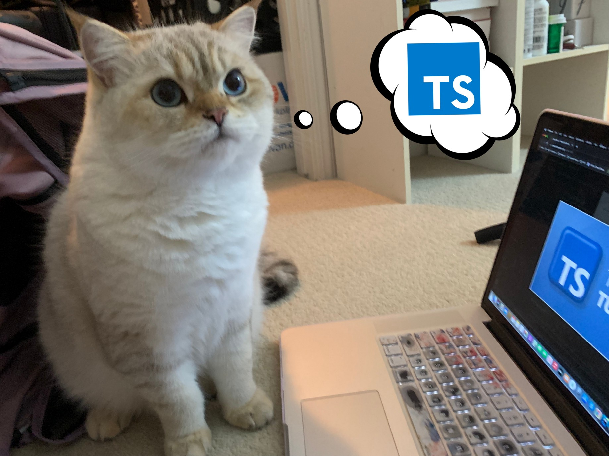

<div align="center">
    <h1>TypeScript Template</h1>

<a href="https://t.me/ExposedCatDev">


</a>
<a href="https://www.reddit.com/user/ExposedCatDev">

</a>



</div>

<div align="center">
    <h2>⭐️ Features</h2>
</div>
<ul>
    <li>Strict code formatting rules</li>
    <li>Scalable file architecture</li>
    <li>Well-readable git repository with a beautiful README</li>
</ul>

<div align="center">
    <h2>💼 TODO</h2>
</div>
<ul>
    <li><s>Add formatting rules</s></a></li>
    <li><s>Add preview</s></a></li>
</ul>

<div align="center">
    <h2>⚙️ Stack</h2>
</div>
<ul>
    <li>Programming language: TypeScript</li>
    <li>Running tools: Node.JS</li>
</ul>

<div align="center">
    <h2>🔌 Running</h2>
</div>

<div align="center">
    <h2>via pure Node.JS</h2>
</div>

1. Clone this repo:

```bash
git clone https://github.com/ExposedCat/typescript-template.git
```

2. Go to the project root:

```bash
cd typescript-template
```

3. Create copy of `.env-example` called `.env` and replace example data with yours
4. Start app (specify name of the config created before):

```bash
npm start
```

**Done**.

<div align="center">
    <h2>🔩 Dependencies</h2>
</div>
<h3>Production</h3>
<ul>
    <!-- <li></li> -->
</ul>
<h3>Development</h3>
<ul>
    <li>TypeScript</li>
    <li>Prettier</li>
</ul>
